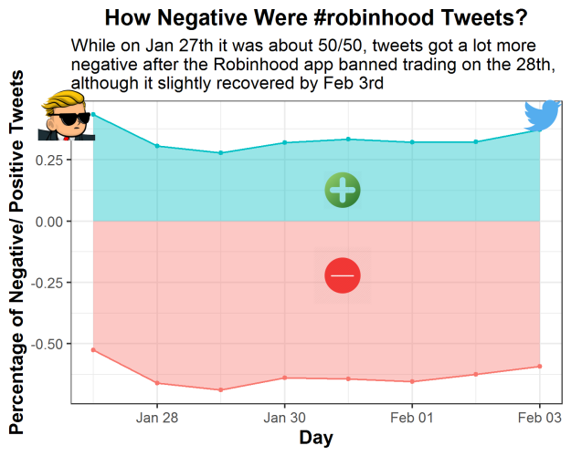
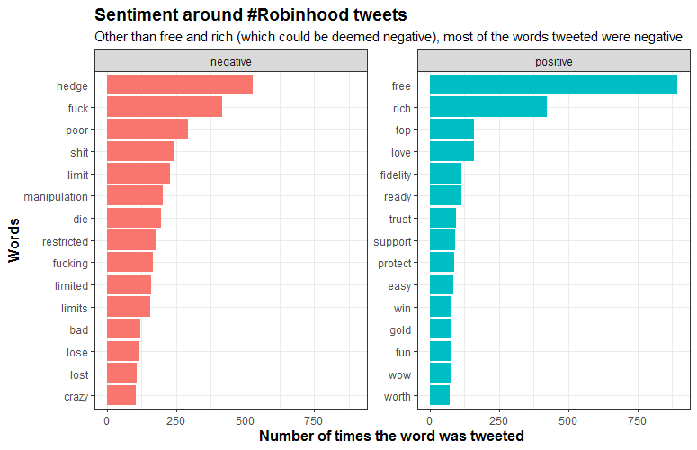
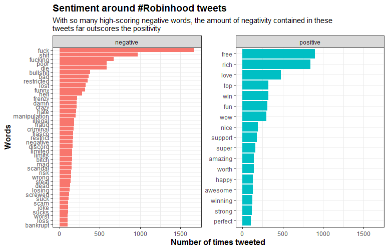
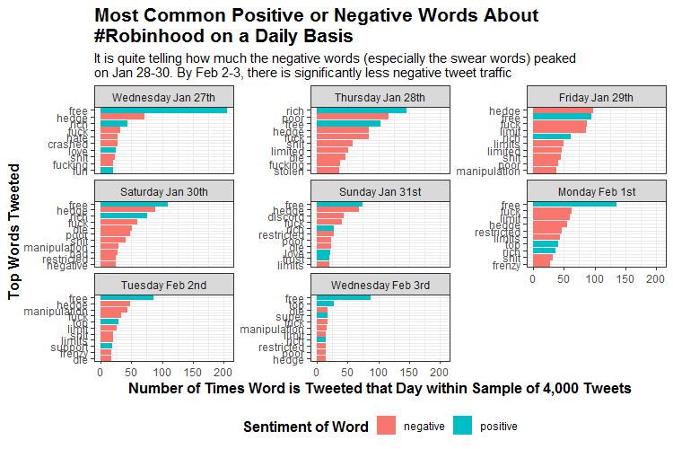
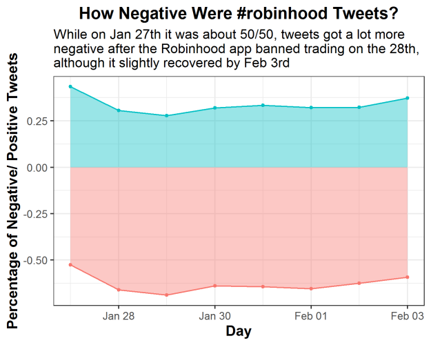

[{width="639"}](https://unsplash.com/s/photos/emotion)

Brands are essential. They live in our minds as ideas and each person constantly interacts with hundreds of brands a day, sometimes positively, sometimes negatively.

But what is their role in data science? Well given most tech is fueled by strong business brands, **it is probably essential for any data scientist to have even a basic understanding of brands**.

In this post, I want to explain how to do a simple brand sentiment analysis using Twitter. My focus? **Robinhood, the trading app.** You probably heard about the GameStop (GME) frenzy that occurred just a couple months ago where Reddit users attempted a short squeeze with GME. Since then, the stock has not calmed down and it has moved from about \~\$40 to a current price of \~\$200. During the initial spike (where it reached \$400), the main trading app of these Reddit users, Robinhood, halted the ability for individuals to buy GME stock. **When you stop your customers/ users from using your brand for their favorite activities, this is definitely a big brand no-no.**

So I decided to do a **quick and dirty Twitter sentiment analysis** to show everybody how that can be useful for getting a read on trends, companies and how they are performing on social media. The result? Not so good for Robinhood... **But stick around to do the analysis yourself!**



```{r include = FALSE}
knitr::opts_chunk$set(message = FALSE)
knitr::opts_chunk$set(warning = FALSE)
knitr::opts_chunk$set(eval = FALSE)
```

#### Step 1: Load the Packages & Download the Data

So I would normally say install the `twitteR` or `rtweet` package and get to work, but unfortunately with trends on Twitter **you are only allowed to pull tweets in the last 7 days**. Luckily, I got most of the data I wanted from Wednesday, January 27 to Wednesday, February 3, giving us a week of tweets from right before the trading halt to right after. Download the data [here at my Github](https://github.com/danderson222/robinhood-sentiment-analysis). If you want more info on scraping Twitter trends check out [this tutorial](https://towardsdatascience.com/twitter-sentiment-analysis-and-visualization-using-r-22e1f70f6967) I used for helping me along the way. Note I borrow a lot of code for my own sentiment analysis, but add additional features that allow you to make more informative sentiment charts.

For information purposes, here is the code I used to scrape Twitter with the `twitteR` package, because it allows me to pull between dates and filter out retweets:

```{r}
rh_tweets_day <- searchTwitter(
  searchString = "#robinhood -filter:retweets", n = 4000, # searches for #robinhood and grabs 4000 tweets, but no retweets
  since = "2021-01-01", until = "2021-01-25") %>% # The until argument does not include the day of
  twListToDF() %>% # turns the list output into a dataframe
  select(text, created, screenName) # selects three columns we want in our analysis
```

And here is the function I made to clean the Twitter data:

```{r}
# make a function to unnest the various words and then get rid of common words with anti_join(stop_words)
find_words <- function(x) {
  x %>% 
    unnest_tokens(word, text) %>% 
    anti_join(stop_words)
}

# Create a list of the dataframes from all the days
df.list <- list(rh_tweets_jan_27, rh_tweets_jan_28, rh_tweets_jan_29,rh_tweets_jan_30, rh_tweets_jan_31, rh_tweets_feb_01, rh_tweets_feb_02, rh_tweets_feb_03)

# Apply the function to the list of dataframes
df.list <- lapply(df.list, find_words)

```

Anyway, you can run my analysis without using that code so **DON'T USE IT** because **IT WON'T WORK** given the dates were from way long ago.

So instead, for our sentiment analysis, the main packages we will be using here are `tidytext` and `tidyverse`, which **allow us to gather the words of each tweet, figure out the sentiment and graph it in a nice way**.

```{r}
# Step 1: Set your working directory and load the required packages in RStudio. 
if(!require("tidyverse")) install.packages("tidyverse")
if(!require("tidytext")) install.packages("tidytext")

# Read in the data from my Github 
# https://github.com/danderson222/robinhood-sentiment-analysis
df <- readRDS("tweets.rds")
```

#### Step 2: Basic Sentiment Analysis

With the data loaded, it's time to see how people feel! You can easily call the top words tweeted, but the same ones show up again and again (e.g. GME, AMC, robinhood, etc.), which **doesn't tell us much about how people are feeling about the Robinhood brand**. So that takes us to the tidytext function `get_sentiment`. There are two types of sentiment that you can evaluate:

1.  **bing** - this type just provides a positive or negative sentiment for the word

2.  **afin** - this type assigns a score to each word based on its positivity/ negativity

So let's run those sentiment analyses:

```{r}
# First we make a new dataframe with three columns: the word, the sentiment its conveying and number of times it is used
df.bing <- df %>% 
  inner_join(get_sentiments("bing")) %>% 
  count(word, sentiment, sort = T) %>% 
  ungroup()

# Then we can run 
df.bing %>% 
  group_by(sentiment) %>%
  # Pull out the top 15 words
  top_n(15) %>% 
  # Reorder top to bottom
  mutate(word = reorder(word, n)) %>% 
  # Make the graph
  ggplot(aes(x = word, y = n, fill = sentiment)) +
  geom_col(show.legend = FALSE) +
  # Facet_wrap makes multiple graphs by the sentiment value in this case
  facet_wrap(~sentiment, scales = 'free_y') +
  labs(title = "Sentiment around #Robinhood tweets",
       subtitle = "Other than free and rich (which could be deemed negative), most of the words tweeted were negative",
       y = "Number of times the word was tweeted",
       x = "Words") +
  coord_flip() + 
  theme_bw() +
  theme(plot.title = element_text(face="bold", size =14), 
        axis.title.x = element_text(face="bold", size = 12),
        axis.title.y = element_text(face="bold", size = 12))
```
 


From this we can see "free" being one of the top positive words, but the number of negative words that were tweeted far outweighs everything else. Now let's look at what the afin sentiment type shows:

```{r}
# Another cool sentiment method is called "afin"
# This assigns a positive or negative score to each word based on its apparent positivity or negativity
df.afin <- df %>% 
  inner_join(get_sentiments("afin")) %>% 
  count(word, value, sort = T) %>% 
  ungroup()
# Here we create a new column to combine the value of each word with the number of times it was used
df.afin$combined_value <- df.afin$value * df.afin$n
# Now let's merge the two sentiment dataframes
df2 <- merge(df.afin, df.bing[-3], by = "word") #Don't merge the n column from df.bing

# This chart shows the total scores for each word by their positive/ negative score and number of times tweeted
df2 %>% 
  group_by(sentiment) %>% 
  top_n(15) %>%
  # We have to take the absolute value for the combined_value column given negative words receive a negative score
  mutate(word = reorder(word, abs(combined_value))) %>%
  # We only want the words that have a score above 100
  filter(abs(combined_value) > 100) %>% 
  ggplot(aes(x = word, y = abs(combined_value), fill = sentiment)) +
  geom_col(show.legend = FALSE) +
  # facet_wrap splits out the charts by the sentiment
  facet_wrap(~sentiment, scales = 'free_y') +
  labs(title = "Sentiment around #Robinhood tweets",
       subtitle = "With so many high-scoring negative words, the amount of negativity contained in these \ntweets far outscores the positivity",
       y = "Number of times tweeted",
       x = "Words") +
  coord_flip() + 
  theme_bw() +
  theme(plot.title = element_text(face="bold", size =14), 
        axis.title.x = element_text(face="bold", size = 12),
        axis.title.y = element_text(face="bold", size = 12))
```
 

So **this graph shows all the words that scored above an 100 sentiment score**. As you can see, there are a lot more negative words with higher point totals than positive words. Some angry tweeters there!

#### Step 3: Charting Sentiment By Day

So after doing the initial sentiment chart, I wanted to **evaluate how the words differed by day**. To do this we 1) group by the day the tweet was created, 2) get the top 10 highest tweeted words, 3) ungroup the words, 4) update the date values and turn them into factors, 5) arrange the words by day and how many times they were tweeted, and 6) finally order them so they graph nicely.

To graph it all we use ggplot and `facet_wrap` to make a graph for each day we collected our tweets. **This is why we had to create our day factor to make sure the days are ordered properly instead of alphabetically like R usually does**. In the end we have 8 graphs, showing how the negative words peaked on January 28th and 29th, and then declined again the week after on February 2nd and 3rd.

```{r}
# Sentiment by day chart
df3 <- merge(df, df.bing, by = "word")
df3 <- df3 %>%
  group_by(created) %>%
  count(word, sort = T) %>%
  top_n(10) %>%
  # Remove grouping
  ungroup() %>%
  # Arrange by facet group & number of occurences 
    arrange(created, n) %>%
  # Add order column of row numbers
  mutate(order = row_number())
df3 <- inner_join(df3, df.bing[-3], by = "word")
# Change the date names 
df3 <- df3 %>%
  mutate(created=ifelse(created=="2021-01-27", "Wednesday Jan 27th",
                        ifelse(created == "2021-01-28", "Thursday Jan 28th",
                               ifelse(created== "2021-01-29", "Friday Jan 29th",
                                      ifelse(created=="2021-01-30", "Saturday Jan 30th",
                                             ifelse(created == "2021-01-31", "Sunday Jan 31st",
                                                    ifelse(created== "2021-02-01", "Monday Feb 1st",
                                                           ifelse(created== "2021-02-02", "Tuesday Feb 2nd",
                                                                  "Wednesday Feb 3rd"))))))))

# Change the factor levels to make sure the plot appears properly. I'm lazy and don't want to type it so create a vector using the unique function instead
days <- unique(df3$created)
days
# And turn the column into a factor
df3$created <- factor(df3$created,levels=c(days[1:8]))
# Graph it
ggplot(df3, aes(x = order, y = n, fill = sentiment)) +
  geom_col() +
  facet_wrap(~created, scales = 'free_y') +
  xlab(NULL) +
  coord_flip() +
  theme_bw() +
  # Add categories to axis
  scale_x_continuous(
    breaks = df3$order,
    labels = df3$word,
    expand = c(0,0)) +
  labs(x = " Top Words Tweeted",
       y = "Number of Times Word is Tweeted that Day within Sample of 4,000 Tweets",
       title = "Most Common Positive or Negative Words About \n#Robinhood on a Daily Basis",
       subtitle = "It is quite telling how much the negative words (especially the swear words) peaked \non Jan 28-30. By Feb 2-3, there is significantly less negative tweet traffic",
       fill = "Sentiment of Word") +
  theme(plot.title = element_text(face="bold", size =16),
        axis.title.x = element_text(face="bold", size = 12),
        axis.title.y = element_text(face="bold", size = 12),
        legend.title = element_text(face="bold", size = 12),
        legend.position = "bottom")
```
 

#### Step 4: Percentage of Positive/ Negative Word Count

So this is all great, but what is the overall view? My last chart is an area graph that converts the sentiment into a percentage for each day. To find this I looked at the total score of emotional words during each day and identified what percentage they were positive or negative. I used the positive/ negative values ascribed to the afin type making the percentages more reflective of stronger sentiment words.

```{r}
df3 <- merge(df, df2, by = "word") %>% 
  select(word, created, value, n, sentiment)
# Create another data frame to merge the two and get the number of times tweeted each day
x <- df %>% 
  group_by(created) %>% 
  count(word, sort = T) %>% 
  ungroup()
df3 <- merge(df3, x, by = c("word", "created"))
colnames(df3) <- c("word", "created", "value", "total_n", "sentiment", "daily_n")
df3 <- df3[!duplicated(df3), ] #get rid of duplicate rows
# Create the combined daily total which looks at the score for positive/ negative by day
df3$combined_daily <- df3$value * df3$daily_n

# I create another dataframe called plot.df for plotting my final chart
plot.df <- df3 %>% 
  group_by(sentiment, created) %>% 
  summarize(area = sum(combined_daily))
totals <- df3 %>% 
  group_by(created) %>% 
  summarize(total_score = sum(abs(combined_daily)))
plot.df <- merge(plot.df, totals, by = "created")
# Calculate the percentage to be graphed
plot.df$percentage <- plot.df$area / plot.df$total_score
class(plot.df$created)
# Graph it with an area chart
plot.df %>% 
  ggplot(aes(x = as.Date(created), y = percentage, color = sentiment, fill = sentiment)) +
  # I like the area plot showing the percentage totals for positive and negative
  geom_area(stat = "identity", alpha = 0.4) +
  geom_point(size = 1) +
  theme_bw() +
  labs(x = "Day",
       y = "Percentage of Negative/ Positive Tweets",
       title = "How Negative Were #robinhood Tweets?",
       subtitle = "While on Jan 27th it was about 50/50, tweets got a lot more \nnegative after the Robinhood app banned trading on the 28th, \nalthough it slightly recovered by Feb 3rd") +
  theme(plot.title = element_text(face="bold", size =14, hjust = 0.5),
        axis.title.x = element_text(face="bold", size = 12),
        axis.title.y = element_text(face="bold", size = 12),
        legend.position = "none") +
  # Save the plot so we can add some icons to it
  ggsave(filename = "output/PositiveNegativeBreakdown.png",
         width = 5, height = 4, dpi = 300)
```
 

#### Step 5: Add Some Icons

Finally, just because we can, let's add some icons to the final graph. For this we use the `magick` package to `image_read` some images from the internet onto your local environment. Then we scale the images down with `image_scale` and place them onto the saved plot with `image_composite`. Actually figuring out where the images best fit took a while and a lot of re-running code, **but that's the fun in adding images to your plots!**

```{r}
# Load the magick library and call back your created plot
if(!require("magick")) install.packages("magick")
plot <- image_read("output/PositiveNegativeBreakdown.png")
# And bring in your images
nice_img <- image_read("https://cdn2.iconfinder.com/data/icons/primitive-gradient/512/xxx014-512.png")
neg_img <- image_read("https://cdn1.iconfinder.com/data/icons/modifiers-essential-glyph-1/48/Mod_Essentials-02-512.png")
wsb_logo <- image_read("https://i.pinimg.com/originals/29/24/89/292489e7d0bf8ce7d5ffd81be62d0800.png") 
twt_logo <- image_read("https://assets.stickpng.com/images/580b57fcd9996e24bc43c53e.png")

# Scale down the logo and give it a border and annotation
# This is the cool part because you can do a lot to the image/logo before adding it
nice_img <- nice_img %>%
  image_scale("100")
neg_img <- neg_img %>%
  image_scale("150")
wsb_logo <- wsb_logo %>%
  image_scale("150")
twt_logo <- twt_logo %>%
  image_scale("150")

# Stack them on top of each other
final_plot <- plot %>% 
  image_composite(nice_img, offset = "+850+450") %>% 
  image_composite(neg_img, offset = "+825+650") %>% 
  image_composite(wsb_logo, offset = "+100+220") %>% 
  image_composite(twt_logo, offset = "+1350+230") 
final_plot
# And overwrite the plot without a logo
image_write(final_plot, "output/FinalPlotWithLogos.png")
```
 

And with that, you have done a minor sentiment analysis on a popular brand like Robinhood. Obviously, you can see that with negative words dominating tweets during the GME trading scandal, the brand definitely took a hit. Although in the end it seemed to get back to about average only a few days later. Maybe this won't have a long-term effect that I thought it would [when I wrote my piece on it as Robinhood was halting trading](https://dylansjanderson.medium.com/robinhoods-upcoming-brand-crisis-83f8a5be7b84).

Anyway, I hope you enjoyed and learned something about brand sentiment analyses. **Yes this is quick. Yes this is dirty. But sometimes that is all you need** to give you a read on what is happening with brands in the public view. I hope to add to this later on with a comparison look using dumbbell charts and Twitter info, broken up by a few months.

------------------------------------------------------------------------

**References:** 
<br> 
[1] Twitter, [#Robinhood Themed Tweets](https://twitter.com/search?q=%23robinhood&src=typed_query), (2021) 
<br>
[2] Tengyart, [Egg Picture](https://unsplash.com/s/photos/emotion), 2021
<br>
[3] Sipra, V. (2020) [Twitter Sentiment Analysis and Visualization using R](https://towardsdatascience.com/twitter-sentiment-analysis-and-visualization-using-r-22e1f70f6967), Towards Data Science
<br>

------------------------------------------------------------------------

*I am a Simulation & Strategy Consultant at Monitor Deloitte, I use stats and analytics to inform Digital Twin models that re-invent the way companies approach strategic decisions. In my free time, I'm obsessed with politics and policy, blogging about it all the time at [Policy In Numbers](https://www.policyinnumbers.com). You can find me there or at my [LinkedIn](https://www.linkedin.com/in/dylansjanderson/) and [Twitter](https://twitter.com/dylansjanderson) accounts (feel free to connect or give me a follow).*
